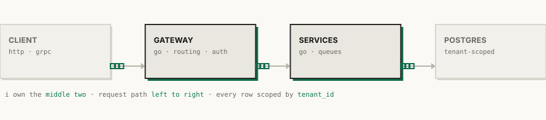

<!--
  PROFILE README — restructured
  Same eight SVG assets, recomposed. No art regenerated.

  TWO THINGS TO SETTLE BEFORE COMMITTING:
  1. linkedin / email / resume below are still example.com placeholders.
  2. relay and paykit have no public repo, so they are not linked.
     See notes at the bottom of this file.
-->

<picture>
  <source media="(prefers-color-scheme: dark)" srcset="assets/header-dark.svg">
  
</picture>

<picture>
  <source media="(prefers-color-scheme: dark)" srcset="assets/now-dark.svg">
  
</picture>

[**tenantguard**](https://github.com/Sour16o4/tenantguard) — detects cross-tenant data leaks in SQL

<picture>
  <source media="(prefers-color-scheme: dark)" srcset="assets/shipped-dark.svg">
  
</picture>

[**gitops-observability-platform**](https://github.com/Sour16o4/gitops-observability-platform) · [**book-inventory-api**](https://github.com/Sour16o4/book-inventory-api)

<picture>
  <source media="(prefers-color-scheme: dark)" srcset="assets/chips-dark.svg">
  
</picture>

<b>How I build and ship</b>

<picture>
  <source media="(prefers-color-scheme: dark)" srcset="assets/pipeline-dark.svg">
  
</picture>

<picture>
  <source media="(prefers-color-scheme: dark)" srcset="assets/arch-dark.svg">
  
</picture>

<b>Activity</b>

<picture>
  <source media="(prefers-color-scheme: dark)" srcset="assets/commits-dark.svg">
  
</picture>

<picture>
  <source media="(prefers-color-scheme: dark)" srcset="assets/contributions-dark.svg">
  
</picture>

[portfolio](https://sourav-salampuria-portfolio.vercel.app) · [linkedin](https://linkedin.com/in/example) · [email](mailto:you@example.com) · [resume](https://example.com/resume.pdf)

<!--
  NOTES

  Portfolio URL above was taken from your sourav-salampuria-portfolio repo.
  Confirm it resolves — I could not reach vercel.app from my sandbox.

  linkedin, email and resume are STILL PLACEHOLDERS and are live on your
  profile right now in this exact form. Replace before committing.

  Your public repos are: Ashen-Ascend, Maven-Web-App, Sour16o4,
  book-inventory-api, gitops-observability-platform,
  sourav-salampuria-portfolio, tenantguard.

  relay and paykit are not among them. The now/ and shipped/ SVGs name both,
  so the page currently advertises two projects a visitor cannot open.
  Either push them, or regenerate those two SVGs without them.
-->
