  

 

I build distributed backends and the tooling that keeps them honest — mostly in Go, with Postgres doing the heavy lifting and Kubernetes running the result. Currently proving row-level tenant isolation and wiring up GitOps/observability stacks end to end.

📎 Portfolio: [sourav-salampuria-portfolio.vercel.app](https://sourav-salampuria-portfolio.vercel.app/)

 

### Tech stack

  
  
  
  
  
  
  
  
  
  

 

### Featured work

| Project | Description | Stack |
|---|---|---|
| [**tenantguard**](https://github.com/Sour16o4/tenantguard) | Proves whether a Go application's SQL respects multi-tenant row isolation, using PostgreSQL RLS as the oracle. |  |
| [**gitops-observability-platform**](https://github.com/Sour16o4/gitops-observability-platform) | A Kubernetes GitOps and observability stack built with KIND, ArgoCD, Prometheus, Grafana, and Loki. |   |
| [**book-inventory-api**](https://github.com/Sour16o4/book-inventory-api) | A REST API for managing book inventory, written in Go. |  |

 

### GitHub stats

  
  

  

